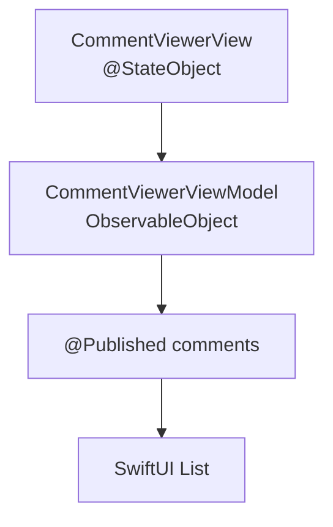

---

# 📦 CommentViewer 母艦 v0.1

SwiftUI で構築された配信コメントビューアの iOS テンプレート。
ViewModel + ObservableObject による状態管理の基本動作を確認済み。

---

## ✅ 現在の到達点（Phase 0）

* SwiftUI `List` によるコメント一覧表示
* `CommentViewerViewModel`（ObservableObject）
* `@StateObject` による ViewModel ライフサイクル管理
* `@Published` によるリアクティブ更新
* Mock ボタンでコメントを追加
* 画面表示時に初期コメントを自動投入

👉 **Mock を押すとリストがリアルタイムで増える**

---

## 🧱 アーキテクチャ（現段階）



---

## 📂 対象ファイル

```
feature/commentviewer/
 ├─ CommentViewerView.swift
 └─ CommentViewerViewModel.swift
```

---

## 🔧 ViewModel

```swift
import Foundation
import Combine

final class CommentViewerViewModel: ObservableObject {
    @Published var comments: [Comment] = []

    func addMock() {
        comments.insert(Comment(text: "こんにちは \(comments.count + 1)"), at: 0)
    }
}
```

---

## 🖥 View

```swift
struct CommentViewerView: View {
    @StateObject private var vm = CommentViewerViewModel()

    var body: some View {
        List(vm.comments) { c in
            VStack(alignment: .leading, spacing: 4) {
                Text(c.text)
                Text(c.createdAt.formatted())
                    .font(.caption)
                    .foregroundStyle(.secondary)
            }
        }
        .toolbar {
            Button("Mock") { vm.addMock() }
        }
    }
}
```

---

## ▶️ 動作確認手順

1. アプリ起動
2. コメント一覧画面を開く
3. **Mock ボタンを押す**
4. コメントが即時追加されることを確認

---

## 🧠 技術ポイント

* `import Combine` を追加しないと
  `ObservableObject` が機能しない
* `@StateObject` は **struct 内に配置必須**
* Preview は `NavigationView` で iOS16 未満の警告回避

---
